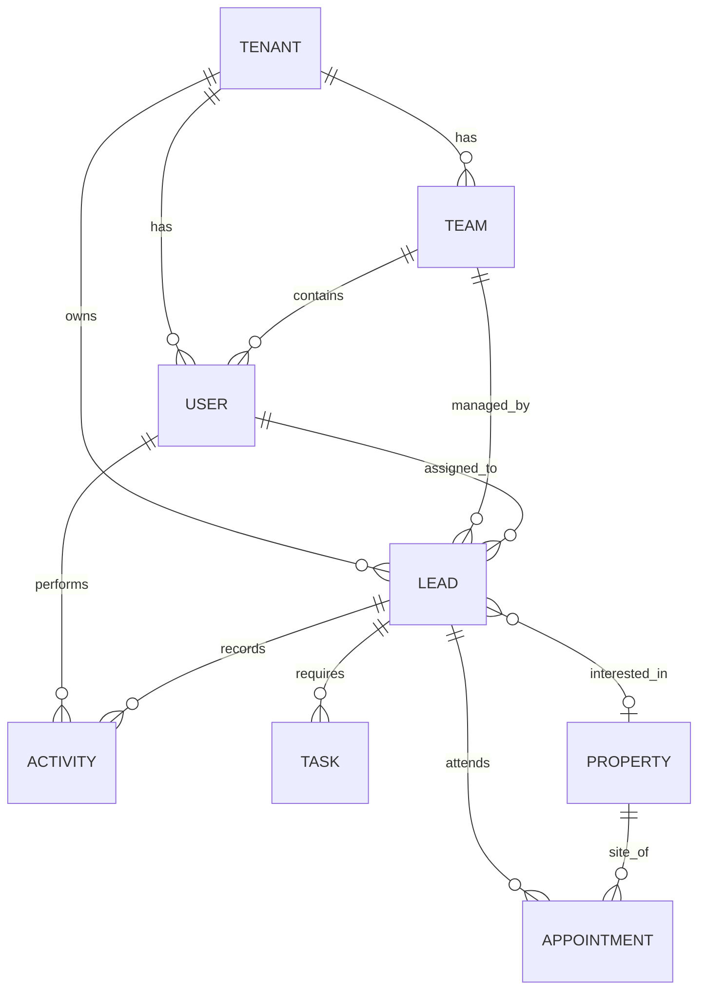

# PropFlow CRM 🚀

PropFlow is a state-of-the-art, multi-tenant Real Estate CRM designed to streamline lead management, sales pipelines, and team collaboration. It is built as a highly modular, role-based platform for modern agencies and developers.


## 📖 Table of Contents
- [✨ Features](#-features)
- [🛠️ Tech Stack](#-tech-stack)
- [🏛️ Architecture & Core Concepts](#️-architecture--core-concepts)
- [📊 Data Model](#-data-model)
- [🔐 Security & Role-Based Access Control (RBAC)](#-security--role-based-access-control-rbac)
- [📂 Project Structure](#-project-structure)
- [🤖 For AI Agents & Collaborators](#-for-ai-agents--collaborators)
- [🚀 Getting Started](#-getting-started)

---

## ✨ Features

- **📊 Comprehensive Dashboard**: Real-time KPI tracking for total leads, hot prospects, pipeline value, and monthly wins.
- **🛣️ Visual Sales Pipeline**: Kanban-style pipeline management with stages: *New, Contacted, Qualified, Viewing, Negotiation, Won, Lost*.
- **👥 Multi-Tenant SaaS**: Support for multiple organizations with complete data isolation and team hierarchies.
- **🎯 Lead Management**: Deep profiles with property interests, activity logs, and lead scoring.
- **📅 Smart Scheduling**: Integrated site visit scheduling and task management with automated alerts.
- **🏠 Property Portfolio**: Manage real estate listings with details on location, price, and developer.

---

## 🛠️ Tech Stack

- **Frontend**: [React 19](https://react.dev/), [TanStack Start](https://tanstack.com/router/latest/docs/framework/react/start/overview) (Server-side rendering + Typesafe routing)
- **State Management**: [React Context](https://react.dev/reference/react/useContext) + [TanStack Query](https://tanstack.com/query/latest) (Ready for API integration)
- **Styling**: [Tailwind CSS 4](https://tailwindcss.com/) (Newest engine), [Radix UI](https://www.radix-ui.com/) (Primitives)
- **Icons & UI**: [Lucide React](https://lucide.dev/), [Sonner](https://sonner.stevenly.me/) (Toasts), [Embla Carousel](https://www.embla-carousel.com/)
- **Charts**: [Recharts](https://recharts.org/)
- **Runtime**: [Bun](https://bun.sh/)
- **Deployment**: [Cloudflare Pages/Workers](https://workers.cloudflare.com/)

---

## 🏛️ Architecture & Core Concepts

### 1. Multi-Tenancy
PropFlow is built as a SaaS. Every data entity (Leads, Users, Teams) belongs to a `Tenant`.
- **Isolation**: Data is scoped at the database/context level based on the current user's `tenantId`.
- **Subscription Levels**: Support for `starter`, `professional`, and `enterprise` plans.

### 2. State & Data Flow
The application uses a layered provider system in `src/routes/__root.tsx`:
1. **`DataProvider`**: Manages the global entity store (Leads, Tasks, etc.). Currently uses mock data but is designed for easy replacement with API calls.
2. **`RoleProvider`**: Computes permissions and scopes data based on the active user.
3. **`SidebarProvider`**: Manages the UI state for navigation.

---

## 📊 Data Model



### Key Entities
- **Tenant**: An organization (e.g., "Acme Realty").
- **User**: Employees within a tenant. Assigned a specific `Role`.
- **Lead**: The core prospect entity. Tracked via `LeadStage`.
- **Property**: Real estate listings available for sale/rent.
- **Activity**: Audit log of interactions (calls, notes, stage changes).

---

## 🔐 Security & Role-Based Access Control (RBAC)

PropFlow implements a strict hierarchy (`OrgRole`):

| Role | Scope | Key Permissions |
| :--- | :--- | :--- |
| **Super Admin** | Platform-wide | Manage tenants, view all data across all orgs. |
| **Manager** | Tenant-wide | Manage teams, settings, and all leads in their org. |
| **Leader** | Team-wide | View and manage leads/members within their team. |
| **Agent** | Individual | Manage only assigned leads and personal tasks. |

*Implementation can be found in `src/lib/role-context.tsx`.*

---

## 📂 Project Structure

```text
src/
├── components/
│   ├── crm/          # Domain-specific UI (StageBadges, LeadCharts, Dialogs)
│   ├── layout/       # App Shell (AppSidebar, Topbar, RoleSwitcher)
│   └── ui/           # Reusable base components (Buttons, Cards, Inputs)
├── hooks/            # Custom hooks (useStore, useRole)
├── lib/              # Core Logic
│   ├── types.ts      # TypeScript interfaces for all entities
│   ├── mock-data.ts  # Seeding logic for the demo
│   ├── data-store.tsx# The entity manager (State logic)
│   └── role-context.tsx# RBAC & Scoping logic
├── routes/           # TanStack Router File-based routes
└── styles.css        # Global CSS & Tailwind 4 Configuration
```

---

## 🤖 For AI Agents & Collaborators

### 🧠 Logic Locations
- **Adding a new data field**: Update `src/lib/types.ts` first, then modify `src/lib/mock-data.ts`.
- **Modifying Permissions**: Edit the `ROLE_PERMS` object in `src/lib/role-context.tsx`.
- **API Integration**: Swap the `useState` hooks in `src/lib/data-store.tsx` with TanStack Query `useQuery` hooks.
- **UI Tweaks**: The project uses **Tailwind CSS 4**. Avoid using `@apply` in CSS; prefer inline utility classes for maximum visibility.

### 🎨 Design System
- **Colors**: Uses semantic naming (e.g., `primary`, `success`, `hot`, `warning`).
- **Layout**: Mobile-first responsive design using the `SidebarProvider`.
- **Interactions**: All dialogs and forms should use the patterns established in `src/components/crm/dialogs.tsx`.

---

## 🚀 Getting Started

### Prerequisites
- [Bun](https://bun.sh/) (Recommended) or Node.js.

### Installation
```bash
bun install
```

### Development
```bash
bun run dev
```

### Build & Deploy
The project is configured for Cloudflare Workers/Pages:
```bash
bun run build
# Deploy using Wrangler
npx wrangler pages deploy .output/public
```

---

## 📄 License

PropFlow is a private repository. All rights reserved.

---
Built with ❤️ by the PropFlow Team.
