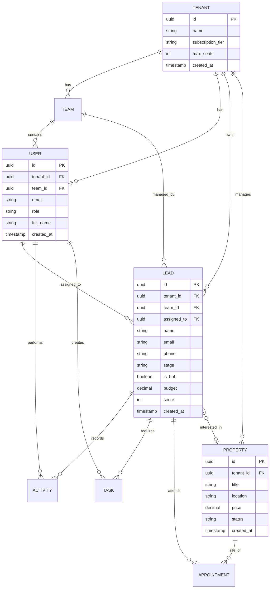

# PropFlow CRM 🚀

PropFlow is a state-of-the-art, multi-tenant Real Estate CRM designed to streamline lead management, sales pipelines, and team collaboration. Built as a highly modular, role-based platform for modern agencies and developers.


## 📖 Table of Contents
- [Project Overview](#-project-overview)
- [Tech Stack](#️-tech-stack)
- [Key Features](#-key-features)
- [Architecture](#️-architecture)
- [Data Model](#-data-model)
- [Security & RBAC](#-security--role-based-access-control-rbac)
- [Recent Updates](#-recent-updates)
- [Project Structure](#-project-structure)
- [Getting Started](#-getting-started)
- [For AI Agents & Collaborators](#-for-ai-agents--collaborators)

---

## 🎯 Project Overview

PropFlow CRM is a comprehensive real estate customer relationship management system built with modern web technologies. It provides a complete solution for managing leads, properties, teams, and sales pipelines in a multi-tenant SaaS architecture.

### What is PropFlow?

PropFlow enables real estate agencies to:
- Track and manage leads through a visual sales pipeline
- Organize teams with hierarchical role-based access control
- Schedule property viewings and manage appointments
- Monitor performance with real-time analytics and KPIs
- Collaborate across teams with complete data isolation per tenant

The platform is designed for scalability, supporting multiple organizations (tenants) with complete data separation and customizable subscription tiers.

---

## 🛠️ Tech Stack

### Frontend Framework
- **[React 19](https://react.dev/)** - Latest React with concurrent features
- **[Vite](https://vitejs.dev/)** - Next-generation frontend tooling
- **[TanStack Router](https://tanstack.com/router/latest)** - Type-safe file-based routing
- **[TanStack Query](https://tanstack.com/query/latest)** - Powerful data synchronization

### Backend & Database
- **[Supabase](https://supabase.com/)** - PostgreSQL database with real-time capabilities
- **Row Level Security (RLS)** - Database-level security policies
- **Edge Functions** - Serverless functions for business logic

### UI & Styling
- **[Tailwind CSS 4](https://tailwindcss.com/)** - Utility-first CSS framework
- **[shadcn/ui](https://ui.shadcn.com/)** - Re-usable component library
- **[Radix UI](https://www.radix-ui.com/)** - Unstyled, accessible UI primitives
- **[Lucide React](https://lucide.dev/)** - Beautiful icon library
- **[Recharts](https://recharts.org/)** - Composable charting library

### Development Tools
- **[TypeScript](https://www.typescriptlang.org/)** - Type-safe JavaScript
- **[Bun](https://bun.sh/)** - Fast all-in-one JavaScript runtime
- **[ESLint](https://eslint.org/)** - Code linting and quality
- **[Prettier](https://prettier.io/)** - Code formatting

### Deployment
- **[Cloudflare Pages/Workers](https://workers.cloudflare.com/)** - Edge deployment platform
- **[Vercel](https://vercel.com/)** - Alternative deployment option

---

## ✨ Key Features

### Core Functionality
- **📊 Real-time Dashboard** - Live KPI tracking with total leads, hot prospects, pipeline value, and monthly wins
- **🛣️ Visual Sales Pipeline** - Kanban-style board with 7 stages: New → Contacted → Qualified → Viewing → Negotiation → Won/Lost
- **👥 Lead Management** - Comprehensive lead profiles with contact info, property interests, activity logs, and automated scoring
- **🏠 Property Portfolio** - Manage listings with location, pricing, developer info, and availability status
- **📅 Appointment Scheduling** - Site visit booking with calendar integration and automated reminders
- **✅ Task Management** - Create, assign, and track tasks with due dates and priorities
- **📈 Analytics & Reporting** - Performance metrics, conversion rates, and team productivity insights

### Multi-Tenant Architecture
- **🏢 Organization Isolation** - Complete data separation between tenants
- **💼 Subscription Tiers** - Starter, Professional, and Enterprise plans
- **👥 Team Hierarchies** - Organize users into teams with leaders
- **🎫 Invitation System** - Secure team member onboarding with email invitations
- **⚙️ Tenant Settings** - Customizable organization preferences and branding

### Collaboration & Security
- **🔐 Role-Based Access Control** - 4-tier permission system (Super Admin, Manager, Leader, Agent)
- **📝 Activity Logging** - Complete audit trail of all lead interactions
- **🔔 Real-time Notifications** - Instant updates via Supabase subscriptions
- **📤 CSV Import/Export** - Bulk data operations with validation
- **🔒 Row-Level Security** - Database-enforced data access policies

### Advanced Features (New)
- **🎯 Automated Lead Scoring** - AI-powered scoring based on engagement, stage, budget, and profile completeness
- **🔍 Duplicate Detection** - Prevents duplicate leads with intelligent matching
- **✨ Input Sanitization** - XSS and SQL injection protection
- **⚡ Real-time Sync** - Live data updates across all connected clients
- **🛡️ Enhanced Security** - CSRF protection, rate limiting, and invitation validation

---

## 🏛️ Architecture

### Multi-Tenant Architecture

PropFlow implements a **shared database, shared schema** multi-tenancy model:

```
┌─────────────────────────────────────────────────────┐
│                   Application Layer                  │
│  ┌──────────────┐  ┌──────────────┐  ┌───────────┐ │
│  │   Tenant A   │  │   Tenant B   │  │  Tenant C │ │
│  │   (Acme RE)  │  │  (Best Props)│  │ (City RE) │ │
│  └──────┬───────┘  └──────┬───────┘  └─────┬─────┘ │
│         │                 │                 │        │
└─────────┼─────────────────┼─────────────────┼────────┘
          │                 │                 │
          └─────────────────┼─────────────────┘
                            │
                    ┌───────▼────────┐
                    │  Supabase DB   │
                    │  (PostgreSQL)  │
                    │                │
                    │  RLS Policies  │
                    │  Filter by     │
                    │  tenant_id     │
                    └────────────────┘
```

**Key Principles:**
- Every table has a `tenant_id` column (except system tables)
- Row-Level Security (RLS) policies enforce tenant isolation
- Users can only access data from their own tenant
- Super admins can view cross-tenant data for platform management

### Role-Based Access Control (RBAC)

PropFlow implements a 4-tier hierarchical permission system:

| Role | Level | Scope | Key Permissions |
|------|-------|-------|-----------------|
| **Super Admin** | Platform | All Tenants | • Manage all tenants<br>• View cross-tenant analytics<br>• Platform configuration<br>• User management across orgs |
| **Manager** | Organization | Single Tenant | • Manage all teams in tenant<br>• View all leads in organization<br>• Configure tenant settings<br>• Invite/remove team members<br>• Approve bulk operations |
| **Leader** | Team | Single Team | • Manage team members<br>• View all team leads<br>• Assign leads to agents<br>• Team performance reports |
| **Agent** | Individual | Own Leads | • Manage assigned leads<br>• Update lead status<br>• Schedule appointments<br>• Log activities |

**Permission Implementation:**
- Defined in [`src/lib/role-context.tsx`](src/lib/role-context.tsx)
- Enforced at both UI and database levels
- Dynamic permission checks using `useRole()` hook
- RLS policies in database mirror application logic

### Authentication Flow

```
┌──────────┐
│  User    │
└────┬─────┘
     │
     │ 1. Login/Signup
     ▼
┌─────────────────┐
│  Supabase Auth  │
│  (JWT Tokens)   │
└────┬────────────┘
     │
     │ 2. Session Created
     ▼
┌─────────────────┐
│  AuthProvider   │  ← src/lib/auth-context.tsx
│  (React Context)│
└────┬────────────┘
     │
     │ 3. Fetch User Profile
     ▼
┌─────────────────┐
│  RoleProvider   │  ← src/lib/role-context.tsx
│  (Permissions)  │
└────┬────────────┘
     │
     │ 4. Compute Permissions
     ▼
┌─────────────────┐
│  Application    │
│  (Protected     │
│   Routes)       │
└─────────────────┘
```

**Authentication Features:**
- Email/password authentication via Supabase
- JWT-based session management
- Automatic token refresh
- Protected routes with middleware ([`src/integrations/supabase/auth-middleware.ts`](src/integrations/supabase/auth-middleware.ts))
- Password reset flow with rate limiting
- Email verification (optional)

### Database Structure Overview

**Core Tables:**
- `tenants` - Organization/company records
- `users` - User accounts with role assignments
- `teams` - Team groupings within tenants
- `leads` - Lead/prospect records
- `properties` - Real estate listings
- `activities` - Interaction audit log
- `tasks` - To-do items and reminders
- `appointments` - Scheduled property viewings
- `invitations` - Team member invitation system

**Key Relationships:**
- Tenant → Users (1:N)
- Tenant → Teams (1:N)
- Tenant → Leads (1:N)
- Team → Users (1:N)
- Team → Leads (1:N)
- User → Leads (1:N, assigned)
- Lead → Activities (1:N)
- Lead → Appointments (1:N)

**Database Migrations:**
Located in [`supabase/migrations/`](supabase/migrations/):
- `001_complete_schema.sql` - Initial schema
- `002_add_tenant_id_and_invitations.sql` - Multi-tenancy
- `003_manager_signup_and_invitations.sql` - Invitation system
- `004_fix_rls_and_seats.sql` - RLS policies
- `005_remove_default_team.sql` - Team cleanup
- `006_fix_teams_rls.sql` - Team permissions
- `007_fix_invitation_redeem.sql` - Invitation fixes
- `008_bulk_operations.sql` - Bulk actions
- `009_performance_indexes.sql` - Query optimization
- `010_enhance_rls_team_filtering.sql` - Enhanced team-based RLS ✨
- `011_password_reset_rate_limiting.sql` - Rate limiting ✨
- `012_invitation_validation.sql` - Enhanced invitation security ✨
- `013_lead_scoring_automation.sql` - Automated lead scoring ✨
- `014_duplicate_lead_detection.sql` - Duplicate prevention ✨
- `015_task_validation_and_orphaned_records.sql` - Data integrity ✨

---

## 📊 Data Model



---

## 🔐 Security & Role-Based Access Control (RBAC)

### Permission Matrix

| Feature | Super Admin | Manager | Leader | Agent |
|---------|-------------|---------|--------|-------|
| View all tenants | ✅ | ❌ | ❌ | ❌ |
| Manage tenant settings | ✅ | ✅ | ❌ | ❌ |
| Create/delete teams | ✅ | ✅ | ❌ | ❌ |
| View all org leads | ✅ | ✅ | ❌ | ❌ |
| View team leads | ✅ | ✅ | ✅ | ❌ |
| View assigned leads | ✅ | ✅ | ✅ | ✅ |
| Edit any lead | ✅ | ✅ | ✅ (team) | ❌ |
| Edit assigned leads | ✅ | ✅ | ✅ | ✅ |
| Assign leads | ✅ | ✅ | ✅ | ❌ |
| Delete leads | ✅ | ✅ | ✅ (team) | ❌ |
| Bulk operations | ✅ | ✅ (approval) | ❌ | ❌ |
| Invite users | ✅ | ✅ | ✅ (to team) | ❌ |
| Manage properties | ✅ | ✅ | ✅ | ✅ (view) |
| View analytics | ✅ | ✅ | ✅ (team) | ✅ (own) |

### Security Implementation

**Database Level (RLS Policies):**
```sql
-- Example: Leads table RLS
CREATE POLICY "Users can view leads in their tenant"
  ON leads FOR SELECT
  USING (tenant_id = auth.tenant_id());

CREATE POLICY "Agents can only update assigned leads"
  ON leads FOR UPDATE
  USING (
    assigned_to = auth.uid() OR
    auth.role() IN ('manager', 'leader', 'super_admin')
  );
```

**Application Level:**
- Permission checks in [`src/lib/role-context.tsx`](src/lib/role-context.tsx)
- Protected routes in [`src/routes/_authenticated.tsx`](src/routes/_authenticated.tsx)
- Conditional UI rendering based on permissions
- API middleware validation

**Security Features:**
- ✅ Input sanitization ([`src/lib/sanitize.ts`](src/lib/sanitize.ts))
- ✅ CSRF protection via JWT ([`docs/CSRF_PROTECTION.md`](docs/CSRF_PROTECTION.md))
- ✅ Rate limiting on authentication endpoints
- ✅ Enhanced RLS team filtering ([`docs/RLS_TEAM_FILTERING.md`](docs/RLS_TEAM_FILTERING.md))
- ✅ Invitation validation with expiration
- ✅ Password reset rate limiting
- ✅ Duplicate lead detection

---

## 🆕 Recent Updates

### Week 3 Completion (2026-05-15) ✅

**Lead Scoring System:**
- Automated lead scoring (0-100 scale) based on engagement, stage, budget, and profile
- Database triggers for automatic score recalculation
- Hot lead detection and prioritization
- Scoring factors: Engagement (40%), Stage (25%), Budget (20%), Profile (15%)
- Implementation: [`src/lib/lead-scoring.ts`](src/lib/lead-scoring.ts), [`supabase/migrations/013_lead_scoring_automation.sql`](supabase/migrations/013_lead_scoring_automation.sql)

**Duplicate Detection:**
- Email uniqueness constraint per tenant
- Intelligent duplicate matching with confidence scores
- Duplicate warning component with merge functionality
- CSV import duplicate detection
- Implementation: [`src/components/crm/DuplicateLeadWarning.tsx`](src/components/crm/DuplicateLeadWarning.tsx), [`supabase/migrations/014_duplicate_lead_detection.sql`](supabase/migrations/014_duplicate_lead_detection.sql)

**Data Validation:**
- Task and appointment date validation (prevents past dates)
- CSV import validation with detailed error reporting
- Email, phone, and budget format validation
- Implementation: [`src/lib/csv-validation.ts`](src/lib/csv-validation.ts), [`supabase/migrations/015_task_validation_and_orphaned_records.sql`](supabase/migrations/015_task_validation_and_orphaned_records.sql)

**Orphaned Records Handling:**
- Automatic reassignment when teams are deleted
- Automatic reassignment when users are deleted
- Default "Unassigned" team creation
- Preservation of audit trail

**UI Components:**
- Reusable EmptyState component ([`src/components/ui/empty-state.tsx`](src/components/ui/empty-state.tsx))
- Reusable ConfirmationDialog component ([`src/components/ui/confirmation-dialog.tsx`](src/components/ui/confirmation-dialog.tsx))
- Responsive mobile sidebar
- Table horizontal scroll for mobile

### Week 2 Completion (2026-05-15) ✅

**Security Enhancements:**
- Input sanitization library ([`src/lib/sanitize.ts`](src/lib/sanitize.ts))
- CSRF protection documentation ([`docs/CSRF_PROTECTION.md`](docs/CSRF_PROTECTION.md))
- Invitation validation with database constraints ([`supabase/migrations/012_invitation_validation.sql`](supabase/migrations/012_invitation_validation.sql))
- Rate limiting helpers for authentication

**Real-time Features:**
- Real-time data synchronization ([`src/hooks/use-realtime.ts`](src/hooks/use-realtime.ts))
- Live updates for leads, tasks, activities, appointments
- Optimistic UI updates with automatic rollback
- Presence tracking for online users

**UI Improvements:**
- Standardized stage badge colors with dark mode support
- Toast notifications verified working
- Avatar fallbacks implemented
- Search functionality verified

### Week 1 Completion (2026-05-15) ✅

**Critical Security Fixes:**
- Enhanced RLS team-based filtering ([`supabase/migrations/010_enhance_rls_team_filtering.sql`](supabase/migrations/010_enhance_rls_team_filtering.sql))
- Password reset rate limiting ([`supabase/migrations/011_password_reset_rate_limiting.sql`](supabase/migrations/011_password_reset_rate_limiting.sql))
- Suspended tenant blocking
- Route-level authorization

**Functionality Restored:**
- Lead data visibility (scopedLeads fixed)
- Task checkboxes with optimistic updates
- Lead completion buttons (won/lost/reopen)
- Property images with fallbacks
- Super admin cross-tenant access
- Team leader scoping corrected

---

## 📂 Project Structure

```text
PropFlow/
├── src/
│   ├── components/
│   │   ├── crm/                    # Domain-specific CRM components
│   │   │   ├── Avatar.tsx          # User avatar with fallback
│   │   │   ├── ClientChart.tsx     # Lead analytics charts
│   │   │   ├── dialogs.tsx         # Lead/Property CRUD dialogs
│   │   │   ├── DuplicateLeadWarning.tsx # Duplicate detection UI ✨
│   │   │   ├── EditTenantDialog.tsx # Tenant settings dialog
│   │   │   ├── HotBadge.tsx        # Hot lead indicator
│   │   │   ├── ImportCsvDialog.tsx # CSV import interface
│   │   │   ├── PageHeader.tsx      # Page title component
│   │   │   └── StageBadge.tsx      # Pipeline stage badges
│   │   ├── layout/                 # Application shell components
│   │   │   ├── AppSidebar.tsx      # Main navigation sidebar
│   │   │   └── Topbar.tsx          # Top navigation bar
│   │   └── ui/                     # shadcn/ui base components
│   │       ├── button.tsx          # Button variants
│   │       ├── card.tsx            # Card container
│   │       ├── confirmation-dialog.tsx # Confirmation dialogs ✨
│   │       ├── dialog.tsx          # Modal dialogs
│   │       ├── empty-state.tsx     # Empty state component ✨
│   │       ├── form.tsx            # Form components
│   │       ├── input.tsx           # Text inputs
│   │       ├── select.tsx          # Dropdown selects
│   │       ├── table.tsx           # Data tables
│   │       └── ...                 # 40+ UI components
│   ├── hooks/
│   │   ├── use-mobile.tsx          # Mobile detection hook
│   │   ├── use-realtime.ts         # Real-time subscriptions ✨
│   │   └── use-supabase.ts         # Supabase query hooks
│   ├── integrations/
│   │   └── supabase/
│   │       ├── auth-middleware.ts  # Route protection
│   │       ├── client.ts           # Supabase client (browser)
│   │       ├── client.server.ts    # Supabase client (server)
│   │       └── types.ts            # Generated DB types
│   ├── lib/
│   │   ├── auth-context.tsx        # Authentication state
│   │   ├── constants.ts            # App constants
│   │   ├── csv-validation.ts       # CSV validation ✨
│   │   ├── export-csv.ts           # CSV export utility
│   │   ├── lead-scoring.ts         # Lead scoring algorithm ✨
│   │   ├── role-context.tsx        # RBAC logic
│   │   ├── sanitize.ts             # Input sanitization ✨
│   │   ├── types.ts                # TypeScript interfaces
│   │   └── utils.ts                # Helper functions
│   ├── routes/                     # TanStack Router file-based routes
│   │   ├── __root.tsx              # Root layout with providers
│   │   ├── _authenticated.tsx      # Protected route wrapper
│   │   ├── login.tsx               # Login page
│   │   ├── signup.tsx              # Registration page
│   │   ├── join.tsx                # Invitation acceptance
│   │   ├── reset-password.tsx      # Password reset
│   │   ├── widget.tsx              # Public lead capture widget
│   │   └── _authenticated/
│   │       ├── index.tsx           # Dashboard
│   │       ├── leads.tsx           # Leads layout
│   │       ├── leads.index.tsx     # Leads list
│   │       ├── leads.$leadId.tsx   # Lead detail
│   │       ├── pipeline.tsx        # Kanban pipeline
│   │       ├── properties.tsx      # Property management
│   │       ├── appointments.tsx    # Calendar view
│   │       ├── tasks.tsx           # Task management
│   │       ├── team.tsx            # Team members
│   │       ├── analytics.tsx       # Reports & analytics
│   │       ├── settings.tsx        # User settings
│   │       ├── admin.tsx           # Tenant management
│   │       └── approvals.tsx       # Bulk operation approvals
│   ├── types/
│   │   └── database.ts             # Database type definitions
│   ├── main.tsx                    # Application entry point
│   ├── router.tsx                  # Router configuration
│   ├── routeTree.gen.ts            # Generated route tree
│   └── styles.css                  # Global styles + Tailwind
├── supabase/
│   ├── config.toml                 # Supabase configuration
│   └── migrations/                 # Database migrations
│       ├── 001_complete_schema.sql
│       ├── 002_add_tenant_id_and_invitations.sql
│       ├── 003_manager_signup_and_invitations.sql
│       ├── 004_fix_rls_and_seats.sql
│       ├── 005_remove_default_team.sql
│       ├── 006_fix_teams_rls.sql
│       ├── 007_fix_invitation_redeem.sql
│       ├── 008_bulk_operations.sql
│       ├── 009_performance_indexes.sql
│       ├── 010_enhance_rls_team_filtering.sql ✨
│       ├── 011_password_reset_rate_limiting.sql ✨
│       ├── 012_invitation_validation.sql ✨
│       ├── 013_lead_scoring_automation.sql ✨
│       ├── 014_duplicate_lead_detection.sql ✨
│       └── 015_task_validation_and_orphaned_records.sql ✨
├── docs/
│   ├── CSRF_PROTECTION.md          # CSRF protection documentation ✨
│   └── RLS_TEAM_FILTERING.md       # RLS documentation ✨
├── .env                            # Environment variables
├── .gitignore                      # Git ignore rules
├── bun.lockb                       # Bun lock file
├── bunfig.toml                     # Bun configuration
├── components.json                 # shadcn/ui config
├── eslint.config.js                # ESLint configuration
├── index.html                      # HTML entry point
├── ISSUES_AND_FIX_PLAN.md          # Issue tracking document ✨
├── package.json                    # Dependencies
├── postcss.config.js               # PostCSS config
├── README.md                       # This file
├── tailwind.config.js              # Tailwind configuration
├── tsconfig.json                   # TypeScript config
├── vercel.json                     # Vercel deployment config
├── vite.config.ts                  # Vite configuration
└── wrangler.jsonc                  # Cloudflare Workers config
```

---

## 🚀 Getting Started

### Prerequisites

Before you begin, ensure you have the following installed:

- **[Bun](https://bun.sh/)** v1.0.0 or higher (recommended) OR **[Node.js](https://nodejs.org/)** v18+ with npm
- **[Git](https://git-scm.com/)** for version control
- **[Supabase Account](https://supabase.com/)** for database and authentication
- A code editor (we recommend [VS Code](https://code.visualstudio.com/))

### Installation

1. **Clone the repository:**
   ```bash
   git clone https://github.com/yourusername/propflow.git
   cd propflow
   ```

2. **Install dependencies:**
   ```bash
   # Using Bun (recommended)
   bun install
   
   # OR using npm
   npm install
   ```

3. **Set up Supabase:**
   - Create a new project at [supabase.com](https://supabase.com)
   - Go to Project Settings → API
   - Copy your project URL and anon key

4. **Configure environment variables:**
   
   Create a `.env` file in the root directory:
   ```env
   VITE_SUPABASE_URL=your_supabase_project_url
   VITE_SUPABASE_ANON_KEY=your_supabase_anon_key
   ```

5. **Run database migrations:**
   ```bash
   # Install Supabase CLI
   npm install -g supabase
   
   # Link to your project
   supabase link --project-ref your-project-ref
   
   # Run migrations
   supabase db push
   ```

### Development

Start the development server:

```bash
# Using Bun
bun run dev

# OR using npm
npm run dev
```

The application will be available at `http://localhost:5173`

### Building for Production

Build the application:

```bash
# Using Bun
bun run build

# OR using npm
npm run build
```

The built files will be in the `dist/` directory.

### Deployment

#### Deploy to Vercel

1. Install Vercel CLI:
   ```bash
   npm install -g vercel
   ```

2. Deploy:
   ```bash
   vercel
   ```

3. Set environment variables in Vercel dashboard

#### Deploy to Cloudflare Pages

1. Build the project:
   ```bash
   bun run build
   ```

2. Deploy using Wrangler:
   ```bash
   npx wrangler pages deploy dist
   ```

### Initial Setup

After deployment, you'll need to:

1. **Create the first super admin account:**
   - Sign up through the application
   - Manually update the user's role in Supabase:
     ```sql
     UPDATE users SET role = 'super_admin' WHERE email = 'your-email@example.com';
     ```

2. **Create your first tenant:**
   - Log in as super admin
   - Navigate to Admin panel
   - Create a new tenant organization

3. **Invite team members:**
   - Go to Team page
   - Send invitations via email
   - Team members can join using the invitation link

---

## 🤖 For AI Agents & Collaborators

### Development Guidelines

#### Adding New Features

1. **Data Model Changes:**
   - Update TypeScript types in [`src/lib/types.ts`](src/lib/types.ts)
   - Create database migration in `supabase/migrations/`
   - Update RLS policies if needed
   - Regenerate types: `supabase gen types typescript --local > src/integrations/supabase/types.ts`

2. **New Routes:**
   - Create file in `src/routes/` following TanStack Router conventions
   - Add to sidebar navigation in [`src/components/layout/AppSidebar.tsx`](src/components/layout/AppSidebar.tsx)
   - Implement permission checks using `useRole()` hook

3. **UI Components:**
   - Use existing shadcn/ui components from `src/components/ui/`
   - Create domain-specific components in `src/components/crm/`
   - Follow Tailwind CSS utility-first approach
   - Ensure mobile responsiveness

#### Code Conventions

**TypeScript:**
- Use strict type checking
- Prefer interfaces over types for object shapes
- Use enums for fixed sets of values
- Document complex types with JSDoc comments

**React:**
- Use functional components with hooks
- Prefer composition over inheritance
- Keep components small and focused
- Use React.memo() for expensive components

**Styling:**
- Use Tailwind utility classes
- Avoid custom CSS when possible
- Use CSS variables for theme colors
- Follow mobile-first responsive design

**Database:**
- Always include `tenant_id` in new tables
- Create RLS policies for every table
- Use indexes for frequently queried columns
- Document complex queries

#### Key Files Reference

| Purpose | File | Description |
|---------|------|-------------|
| Authentication | [`src/lib/auth-context.tsx`](src/lib/auth-context.tsx) | Auth state management |
| Permissions | [`src/lib/role-context.tsx`](src/lib/role-context.tsx) | RBAC logic |
| Database Types | [`src/integrations/supabase/types.ts`](src/integrations/supabase/types.ts) | Generated from Supabase |
| App Types | [`src/lib/types.ts`](src/lib/types.ts) | Application interfaces |
| Constants | [`src/lib/constants.ts`](src/lib/constants.ts) | App-wide constants |
| Utilities | [`src/lib/utils.ts`](src/lib/utils.ts) | Helper functions |
| Sanitization | [`src/lib/sanitize.ts`](src/lib/sanitize.ts) | Input sanitization |
| Lead Scoring | [`src/lib/lead-scoring.ts`](src/lib/lead-scoring.ts) | Scoring algorithm |
| CSV Validation | [`src/lib/csv-validation.ts`](src/lib/csv-validation.ts) | Import validation |
| Real-time | [`src/hooks/use-realtime.ts`](src/hooks/use-realtime.ts) | Live updates |
| Supabase Client | [`src/integrations/supabase/client.ts`](src/integrations/supabase/client.ts) | Database client |

#### Testing Strategy

While tests are not yet implemented, follow these guidelines:

1. **Unit Tests:** Test utility functions and business logic
2. **Integration Tests:** Test API interactions and data flow
3. **E2E Tests:** Test critical user journeys
4. **Accessibility Tests:** Ensure WCAG compliance

#### Performance Optimization

- Use React.lazy() for code splitting
- Implement virtual scrolling for large lists
- Optimize images with proper formats and sizes
- Use Supabase indexes for complex queries
- Implement caching with TanStack Query

#### Security Best Practices

- Never expose sensitive keys in client code
- Always validate user input (use [`src/lib/sanitize.ts`](src/lib/sanitize.ts))
- Use parameterized queries (Supabase handles this)
- Implement rate limiting on sensitive endpoints
- Keep dependencies updated
- Follow OWASP security guidelines

---

## 📄 License

PropFlow is a private repository. All rights reserved.

---

## 🤝 Contributing

This is a private project. For internal contributors:

1. Create a feature branch from `main`
2. Make your changes following the guidelines above
3. Test thoroughly
4. Submit a pull request with detailed description
5. Wait for code review and approval

---

## 📞 Support

For questions or issues:
- Create an issue in the repository
- Contact the development team
- Check the documentation in this README
- Review [`ISSUES_AND_FIX_PLAN.md`](ISSUES_AND_FIX_PLAN.md) for known issues

---

**Built with ❤️ by the PropFlow Team**

*Last Updated: 2026-05-15*
*Version: 1.2.0*
